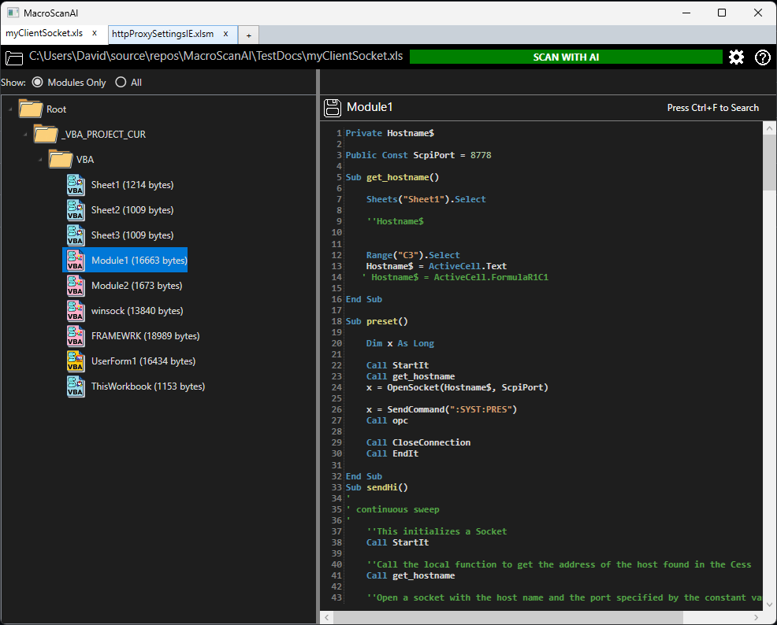
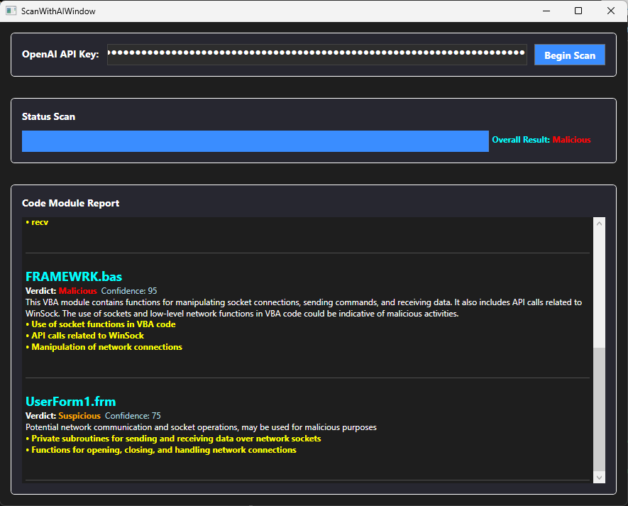

# MacroScanAI
**AI-Powered Macro Security Analyzer**  
An AI-powered cybersecurity solution for identifying malicious Office VBA macros. MacroScanAI offers dual functionality: use the command line for automated analysis and structured JSON reporting, or leverage the clean, dark-themed UI for interactive code visualization and forensic triage.


---

## Command-Line Usage

MacroScanAI can be run from the command line to analyze VBA code in a document and generate a JSON report.

### Basic syntax

```
MacroScanAI.exe <SourceFilePath> <OutputDirectory> [--apikey <YourOpenAIKey>]
```

- `<SourceFilePath>`: Path to the Office file you want to scan (e.g., `.xls`, `.doc`, etc.).  
- `<OutputDirectory>`: Directory where the JSON report will be saved.  
- `--apikey <YourOpenAIKey>` (optional): Your OpenAI API key. If not provided, the application will look for the environment variable `OPENAI_API_KEY`.

---

### There are two ways of passing API key from command line

#### 1) Using an environment variable for the API key

```
setx OPENAI_API_KEY "sk-fakeapikey1234567890"
MacroScanAI.exe "C:\myClientSocket.xls" "C:\TestResults"
```

#### 2) Passing the API key directly on the command line

```
MacroScanAI.exe "C:\myClientSocket.xls" "C:\TestResults" --apikey sk-fakeapikey1234567890
```

---

### Output

MacroScanAI generates a JSON file named after the input file with the suffix `.report.json`. For example, if the input file is:

```
myClientSocket.xls
```

The report file will be:

```
myClientSocket.xls.report.json
```

---

### Example JSON report

```json
{
  "SourceFilePath": "C:\\myClientSocket.xls",
  "ReportGeneratedAt": "2025-11-21T21:31:02.0193615Z",
  "AllCodeVerdict": "Suspicious",
  "Modules": [
    {
      "moduleName": "Module1.bas",
      "verdict": "Benign",
      "confidence": 80,
      "summary": "The VBA module contains functions related to socket communication and data processing. It does not exhibit typical indicators of malicious behavior.",
      "indicators": []
    },
    {
      "moduleName": "UserForm1.frm",
      "verdict": "Suspicious",
      "confidence": 85,
      "summary": "Potential communication over a network with unclear intentions.",
      "indicators": [
        "Communication with remote host",
        "Socket operations"
      ]
    }
  ]
}
```

**Field descriptions:**

- `SourceFilePath`: Original file scanned.  
- `ReportGeneratedAt`: Timestamp when the report was generated.  
- `AllCodeVerdict`: Aggregated verdict across all modules (`Benign`, `Suspicious`, or `Malicious`).  
- `Modules`: Array containing per-module results, including a textual summary, confidence percentage, and a list of indicators.

---

## 🚀 Overview

MacroScanAI is designed for security analysts, researchers, IT administrators, and developers who need a fast and accurate way to assess the risk posed by VBA macros embedded inside Office documents.

Combining static analysis with AI-enhanced pattern recognition, MacroScanAI helps identify:

- 🔍 **Malicious, Suspicious, or Benign VBA code**  
- 🧬 **Obfuscation techniques** (string manipulation, hidden payloads, hex blobs, base64, etc.)  
- 🔐 **Decryption or encryption routines**  
- 🌐 **Network calls, shell execution, and COM automation abuse**  
- 📦 **Suspicious API imports and unusual Office object usage**  
- ⚠️ **Patterns commonly seen in malware-laced documents**

The tool also includes a **Code Visualization Navigator**, making it easy to explore modules, procedures, and scan results.

---

## 🖼️ Screenshots of UI

<p align="center">
  
  
</p>

### **Macro Navigator UI**
A clean, dark-themed interface for browsing document modules and visualizing macro code.

### **AI-Powered Scan Results**
Summary verdict, indicators, and detailed module-by-module analysis.

---

## ✨ Key Features

- 🤖 **AI-Assisted Macro Analysis**  
  Automatically classifies macros as *Benign*, *Suspicious*, or *Malicious* with confidence scoring.

- 🧩 **Threat Pattern Detection**  
  Detects obfuscation, payload construction, shell commands, API calls, and more.

- 🗂️ **Interactive Code Navigator**  
  Visualize modules, procedures, and scan results side-by-side.

- 📄 **Supports Office Document Formats**  
  Scans VBA included in legacy OLE (.doc, .xls, .ppt) and modern OOXML (.docm, .xlsm, .pptm) documents.

- ⚡ **Fast Local Analysis**  
  Extracts and analyzes macro content quickly.

---

## 🛠️ How It Works

1. **Load an Office document** containing VBA macros.  
2. **MacroScanAI extracts** modules and procedures using a built-in parser.  
3. **AI-powered analysis** evaluates each module’s behavior.  
4. **Results are displayed** in a structured, hyperlinked UI.  
5. You receive a **final verdict** and a list of **behavioral indicators**.

---

## License

This project is licensed under the **GNU GPL v3.0**.

It also incorporates code originally licensed under the **Mozilla Public License 2.0**.

Under Section 3.3 of the MPL-2.0, that code is redistributed under GPL-3.0 for combined distribution.

- GPL-3.0: https://www.gnu.org/licenses/gpl-3.0.html  
- MPL-2.0: https://www.mozilla.org/MPL/2.0/


